<div align="center">

<h3><code>jashan@github ~ $ ./contributions.sh</code></h3>


<br><br>

<h3><code>jashan@github ~ $ whoami</code></h3>
<table>
  <tr>
    <td valign="top"></td>
    <td valign="top"></td>
  </tr>
</table>

</div>

---

## About me
I'm a first year CSE-DS student who likes building real projects, not just assignment code. Currently learning how data can solve problems that actually matter to people.

- 🎓 &nbsp; B.E in Computer Science (Data Science) — 2nd year incoming
- 🌱 &nbsp; Currently learning — Data Structures, Python for Data Science, SQL
- 🛠️ &nbsp; I build small tools and deploy them. If it's not live, it doesn't count
- 📍 &nbsp; Based in Bengaluru, India
- 💬 &nbsp; Ask me about Python, C, or anything GitHub

---

## Skills
```python
languages  = ["Python", "C"]
currently  = ["Data Structures & Algorithms", "Data Analysis", "Git & GitHub"]
learning   = ["SQL", "Pandas", "Machine Learning basics"]
```

<p align="left">
  
</p>

---

## Currently working on
- 🔭 &nbsp; Building out **Dev vs Dev Battle Card** — adding more stat categories
- 📈 &nbsp; Sharpening DSA fundamentals (arrays → trees, one topic at a time)
- 🧩 &nbsp; Picking up SQL + Pandas for a data-analysis side project
- 🎯 &nbsp; Goal: one small shipped project every month

---

## Projects
| Project | What it does | Live |
|--------|-------------|------|
| ⚔️ **Dev vs Dev Battle Card** | Compares two GitHub profiles in a live stat-by-stat battle. Real data, no API key needed. | [Try it live](https://jashan2128.github.io/Dev-Battles) |

> More projects incoming — currently building in public.

---

## GitHub stats


---

## Let's connect
I'm open to collaborating on projects, hackathons, or anything interesting.

[](https://www.linkedin.com/in/jashanpreet-singh-a57384370/)
[](https://github.com/jashan2128)
[](mailto:your-email@example.com)
[](https://jashan2128.github.io/Dev-Battles)

> 📝 &nbsp; Swap `your-email@example.com` above for your real address, and the Portfolio link if you make a dedicated site later.

---

<p align="center">
  
</p>
<p align="center"><i>"Build things. Deploy them. Repeat."</i></p>
